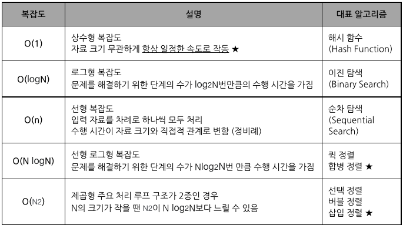

### 정렬 알고리즘

- 선택정렬 : O(n^2)
- 삽입정렬 : O(n^2)
- 버블정렬 : O(n^2)
- 합병정렬 : O(Nlog2N)

### 소프트웨어 품질 측정 개발자관점
- 정확성, 신뢰성, 효율성, 무결성, 유연성, 이식성, 재사용성, 상호운용성

### 트리
- 차수 : 가장 많은 가지를 치고있는 개수
- 단말 노드 : 자식 노드가 0인 것의 개수
- 전위 순회 : Root > Left > Right
- 중위 순회 : Left > Root > Right
- 후위 순회 : Left > Right > Root

### 디지털 저작권 관리의 기술 요소

- 암호화(Encryption): 콘텐츠 및 라이선스를 암호화하고 전자서명을 할 수 있는 기술
- 키 관리(Key Management): 콘텐츠를 암호화한 키에 대한 저장 및 분배 기술
- 식별 기술(Identification): 콘텐츠에 대한 식별 체계 표현 기술
- 저작권 표현(Right Expression): 라이선스의 내용 표현 기술
- 암호화 파일 생성(Packager): 콘텐츠를 암호화된 콘텐츠로 생성하기 위한 기술
- 정책 관리(Policy Management): 라이선스 발급 및 사용에 대한 정책 표현 및 관리 기술
- 크랙 방지(Tamper Resistance): 크랙에 의한 콘텐츠 사용 방지 기술
- 인증(Authentication): 라이선스 발급 및 사용의 기준이 되는 사용자 인증 기술

### 파레토(Pareto) 법칙
20%의 모듈에서 80%의 결함 발견

### 살충제 패러독스
동일한 테스트 케이스에 의한 반복적 테스트는 새로운 버그를 찾지 못

### 검증 테스트 
- 개발자의 시각에서 테스트하는 것

### 확인 테스트
- 사용자의 시각에서 테스트하는 것
인수테스트 (알파테스트(회사 내부), 베타테스트(일부 사용자들에게 배포))
  

### 화이트박스 테스트
- 모듈 안의 내용을 볼 수 있음
- 내부의 논리적인 모든 경로를 테스트하여 테스트케이스 설계
- 소스 코드의 모든 문장을 한번 이상 수행함으로써 진행됌
- 선택, 반복 등의 부분들을 수행함으로써 논리적 경로 점검

- 기초 경로 검사 : 대표적인 화이트박스 테스트기법, 실행 경로의 정의하는 지침으로 사용
- 조건 검사 : 논리적 조건
- 루프 검사 : 반복 구조에 맞춰 테스트
- 데이터 흐름 검사 : 변수의 정의와 변수 사용의 위치에 초첨을 맞춰 테스트

### 블랙박스 테스트
- 모듈 안에서 어떤 일이 일어나는지 알 수 없음
- 소프트웨어가 수행알 특정 기능을 알기 위해 각 기능이 완전히 작동되는 것을 입증하는 테스트로 기능테스트 라고도 함
- 소프트웨어 인터페이스에서 실시

- 동치 분할 검사 : 입력 조건에 타당한 입력자료와 타당하지 않은 입력 자료의 개수를 균등하게 해 테스트를 정하고 입력 자료에 맞는 결과가 출력되는지 확인
- 경계값 분석 : 입력 조건의 중간값보다 경계값에서 오류가 발생할 확률이 높다는점을 이용해 조건의 경계값을 테스트 케이스로 선정
- 원인 . 효과 그래프  검사 : 입력 데이터 간의 관계와 출력에 영향을 미치는 상황을 체계적으로 분석한 다음 호율성이 높은 케이스를 선정하여 검사
- 비교 검사 : 여러 버전의 프로그램에 동일한 테스트자료를 제공해 동일한 결과가 출력되는지 테스트
- 오류 예측 검사 : 다른 블랙박스 테스트 기법으로 찾아낼 수 없는 오류를 찾아냄

### 상향식 통합 테스트
- 하위 모듈에서 상위 모듈로 통합하면서 테스트
- 클러스터 필요

### 하향식 통합 테스트
- 상위 모듈에서 하위 모듈 방향으로 통합
- 깊이 우선 통합법, 넓이 우선 통합법
- 테스트 초기부터 사용자에게 시스템 구조를 보여줄 수 있음
- 상위 모듈에서는 테스트 케이스를 사용하기 어려움
- 스텁(Stub)

### 소스 코드 품질 분석 도구의 종류
- 동적 분석 도구 : Avalanche, Valgrind

### EAI
- 기업 내 각종 애플리케이션 및 플랫폼 간의 정보 전달, 연계, 통합 등 상호 연동이 가능하게 해주는 솔루션
- 포인트 투 포인트 : 점대 점으로 연결하는 방식, 변경 및 재사용이 어려움
- 허브 앤 스포크 : 단일 접점인 허브 시스템을 통해 데이터를 전송하는 중앙 집중형 방식, 허브 장애시 전체 시스템에 영향
- 메시지 버스 : 애플리케이션 사이에 미들웨어를 둬 처리하는 방식
- 하이브리드 : 허브 앤 스포크와 메시지버스를 혼합한 방식

### ESB
- 서비스 중심의 통합을 지향
- 결합도를 약하게 유지함

### 인터페이스 구현 검증도구
- xUnit : 다양한 언어를 지원하는 단위 테스트 프레임워크
- STAF : 서비스 호출 및 컴포넌트 재사용
- FitNesses : 웹 기반 테스트케이스 설계, 실행, 결과 확인 등
- NTAT : STAT와 FitNesses의 기능을 통합한 NHN의 테스트 자동화 프레임워크
- Selenium : 다양한 브라우저 및 개발언어 지원
- watir : Ruby 사